# Dental Booking Application Project
This is a team project for our coursework assignment and for academic purpose, developed and built using the React Native framework, in the end we produced an Android platform based application that allows user to 
1. Login or register their account.
2. Edit their account information.
3. Customizable light/dark theme of most of the application.
4. Get necessary information about the services, addresses about the dental clinic.
5. Book for appointment with the clinic
6. Check, cancel and update upcoming appointment.
7. live chat with the clinic staff.

## Project Outcome: 
* Learned how to implement UI components.
* Ability to implement wireless communications on our backend communication system, application is able to synchronize booking data made by users, making our application more responsive.
* Implemented and automated the process of booking an appointments.

## My contribution:
Implemented the front and back end of the booking system and appointment record display system.

## Database API server
This project repository also contains a python file which is scripted to run the database API server, which for educational and budget purpose, will be hosted locally.

## Screenshots:
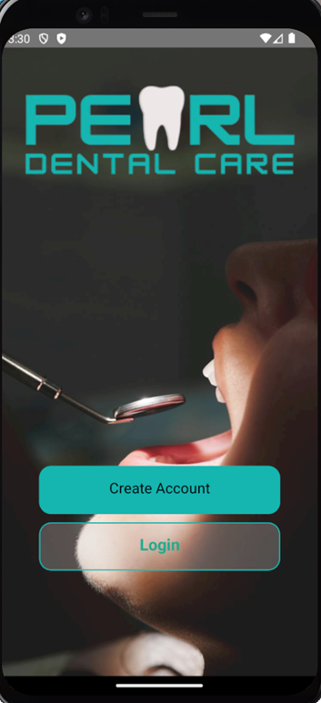

The first thing you will see after running the application.

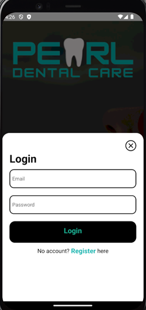

Allows user to login to their account which saves their previous customization and appointment records.

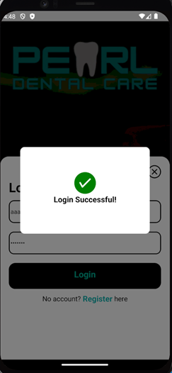

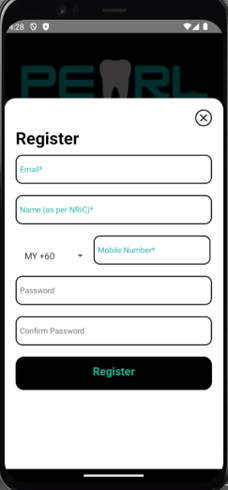

Allows user to create new account, which will be saved to the local database inside the mobile phnoe.

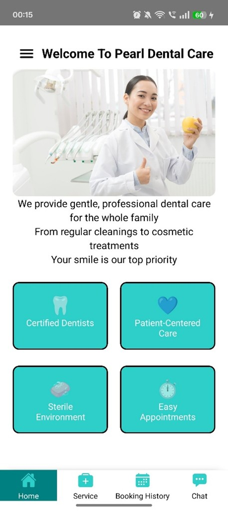

Welcomes the user to the application, the user have two methods of navigating the screens, either by swiping or tapping on the bottom bar icons.
Tapping on the burger icon on the top left will take the user to the User Profile screen, which will expose more menus and screen for the user to navigate through.

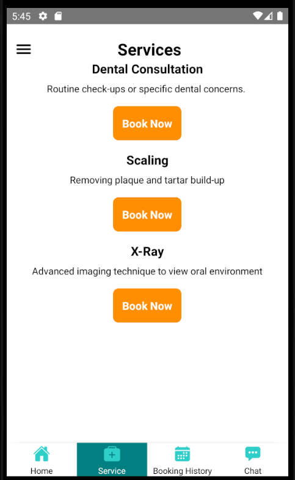

This is the first of the booking process, an registered user can pick their needed services in this page. 
This and the following part of the application is contributed by me and another one of my team members.

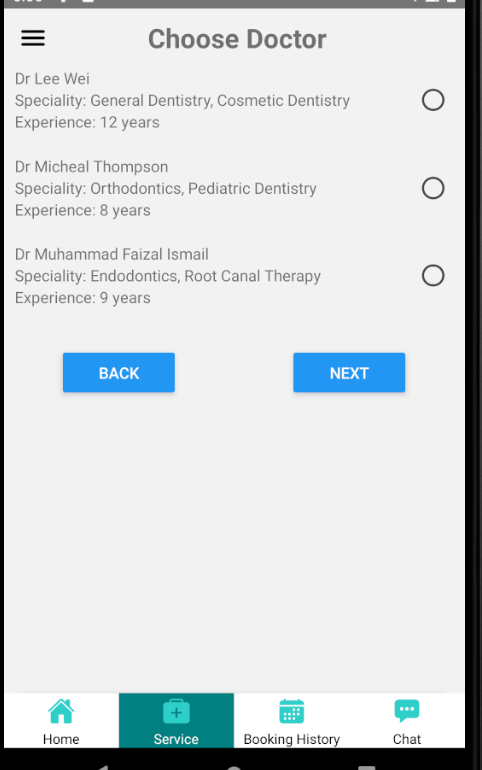

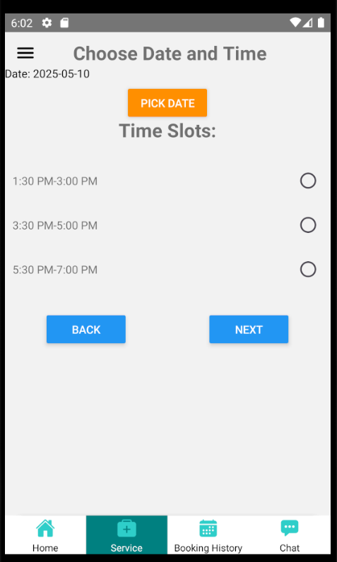

There is simple API involved in this process called OpenHolidays API, I used REST architecture to implement the checking of whether the selected date is a holiday or not.
I have faced the challenge of filtering through the large amount of data types send by the API server, which required me quite some time to tweak the request parameters to fit my use case.

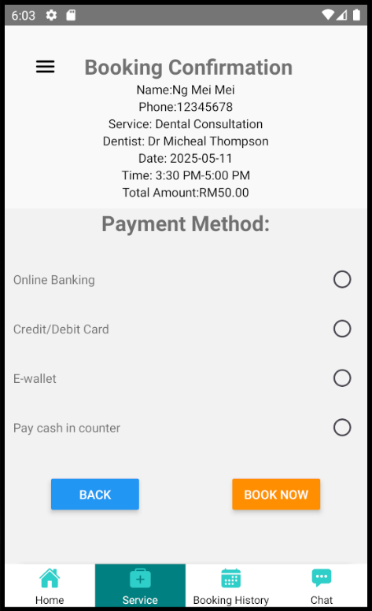

This will be the last step of the booking process, there were originally plans to implement a type of payment API, but due to budget constraints, it is discarded and left as it is.
After confirming the booking of the appointment, the app will send appointment data to database API server which will handle all the CRUD queries by the application.

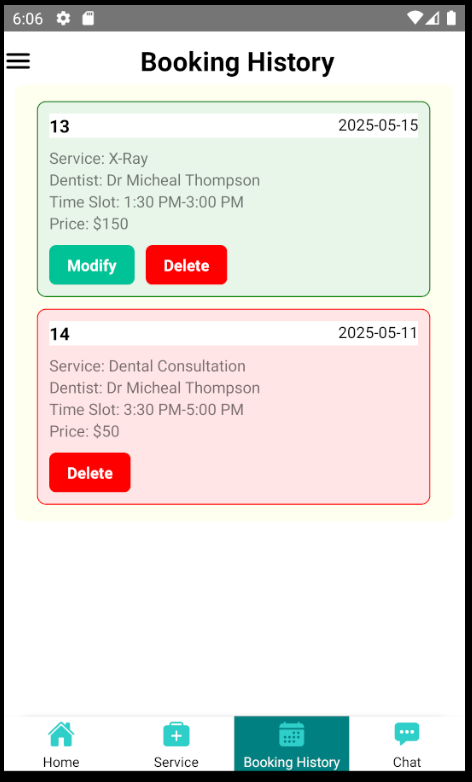

This page will load the appointment record by the current registered user, it will show both active and inactive appointments, inactive appointments cannot be changed except deleting it.
Clicking on the modify button will take the uesr to the next following screen.

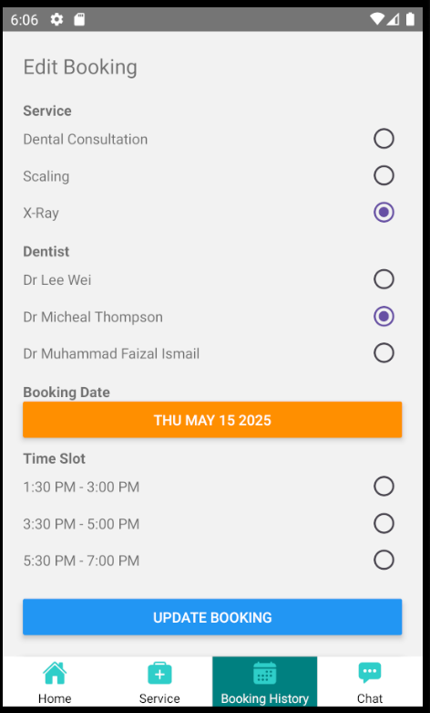

This part also includes the holiday checking, change of services will require user to select payment again.
After it is done, the new updated booking data will be sent back to the database API server.

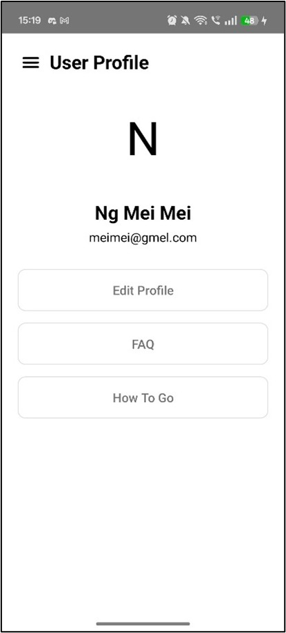

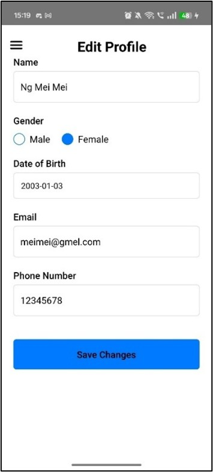

The modification on the user account will only make change on the local database on the device, this is also to test the implementation of local data persistency.

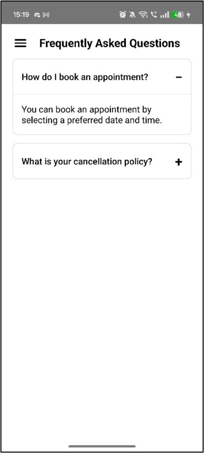

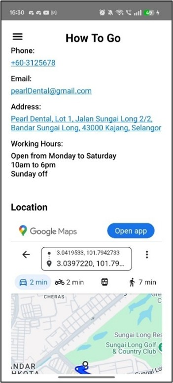
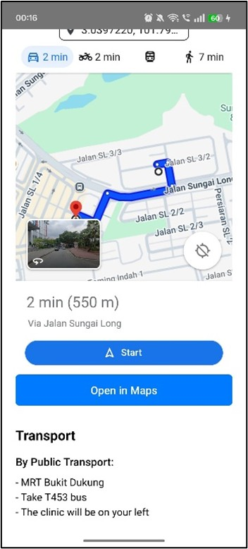

We have utilized Geolocation API and WebView to provide location-functionality, such as showing the user’s current location, displaying the directions to the clinic, and opening the clinic’s location in a map application. 
The Geolocation API is used to get the user’s current location (latitude and longitude). 
It also ensures accurate directions by using real-time location data. 

